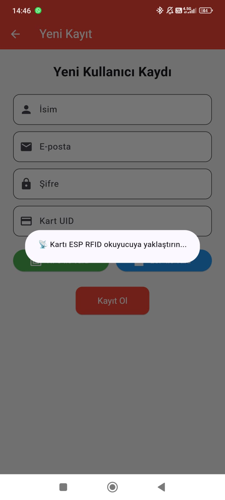
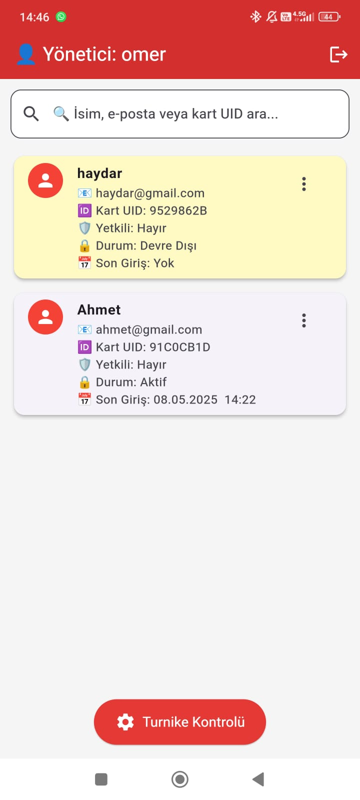
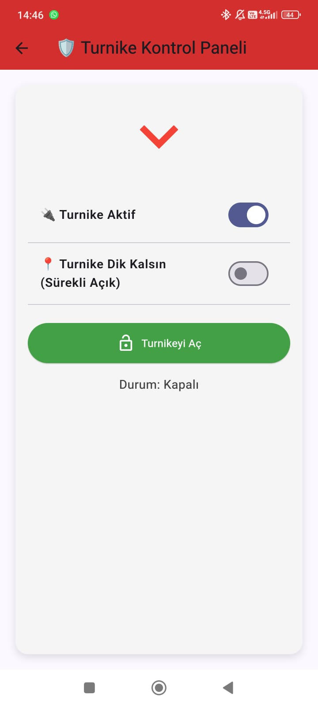
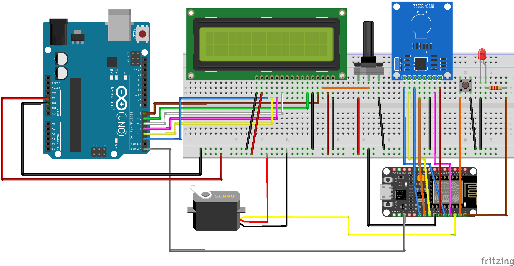

# 📡 ESP8266 RFID ve Mobil Kontrol Destekli Akıllı Turnike Sistemi 

📌 **ESP8266, RFID teknolojisi, Firebase ve Flutter tabanlı mobil uygulama kullanılarak geliştirilen akıllı geçiş kontrol sistemi projesidir.** Kullanıcılar fiziksel RFID kartlarıyla ya da mobil uygulama üzerinden uzaktan kontrol sağlayarak geçiş yapabilir.

## 🚀 Özellikler
- RFID ve NFC kartları ile hızlı ve güvenli geçiş.
- Flutter tabanlı mobil uygulama üzerinden kullanıcı ve admin yönetimi.
- Firebase entegrasyonu sayesinde anlık kullanıcı yönetimi ve loglama.
- Servo motor ile otomatik açılıp kapanan turnike sistemi.
- EEPROM kullanarak kısa süreli tekrar geçişleri engelleme (30 saniye limit).

---

## 🛠️ Kullanılan Donanımlar ve Teknolojiler

| Donanım / Yazılım        | Kullanım Amacı                      |
|---------------------------|-------------------------------------|
| **ESP8266 (NodeMCU)**     | Wi-Fi bağlantısı ve merkezi kontrol |
| **RC522 RFID Modülü**     | RFID kart UID okuma                 |
| **SG90 Servo Motor**      | Turnikenin fiziksel kontrolü        |
| **Arduino UNO & 16x2 LCD**| Kullanıcı bilgilendirme ekranı      |
| **Firebase RTDB**         | Gerçek zamanlı kullanıcı verileri   |
| **Flutter**               | Mobil uygulama geliştirme           |

---

---

## 📱 Mobil Uygulama Ekranları

| Giriş Ekranı | Kayıt Ekranı | RFID Tarama |
|--------------|--------------|-------------|
|  |  |  |

| Kullanıcı Paneli | Yönetici Paneli | Yönetici İşlemleri |
|------------------|-----------------|--------------------|
|  |  |  |

| Turnike Kontrol Paneli | Devre Şeması |
|------------------------|--------------|
|  |  |

---

## 📚 Kurulum ve Detaylar
Projenin tüm detayları ve kurulum adımları için [`docs/Proje_raporu.pdf`](docs/Proje_raporu.pdf) dosyasına bakınız.

## 📄 Lisans
MIT Lisansı ile lisanslanmıştır.
